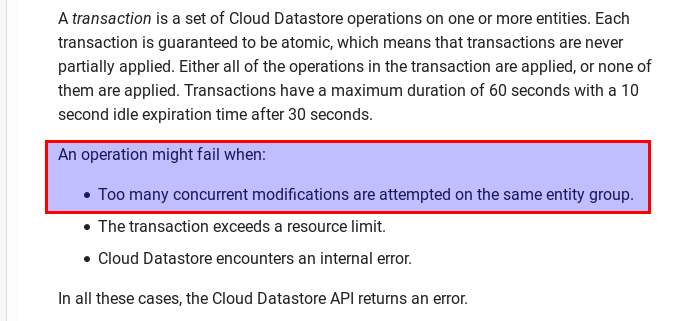
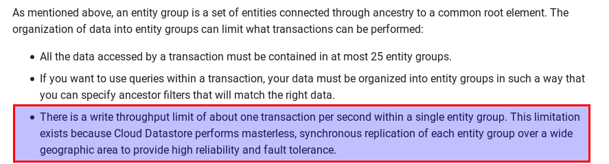

### How about datastore

GCPUG Shonan vol.16 feat.Datastore

---

### お品書き

- Case1 トランザクション同時実行の制約
- Case2 トランザクション内、Entity Groupの制約
- Case3 トランザクションの有効期限
- Case4 task queueはroll back対象？

---

### 検証プログラムのデプロイデプロイ

```
# in cloud shell
$ git clone https://github.com/saizz/how-about-datastore
$ cd how-about-datastore
$ export GOPATH=$(pwd)

# change application in app.yaml
$ vi src/backend/app.yaml

# deploy
$ gcloud app create --region=asia-northeast1 --project=xxx
$ goapp deploy src/backend
```

---

### Case1 トランザクション同時実行の制約

---

## 同じエンティティグループに、同時に多くの操作を行うとエラーになるよ



https://cloud.google.com/appengine/docs/standard/go/datastore/transactions

---

## ここでも



https://cloud.google.com/appengine/docs/standard/go/datastore/entities
